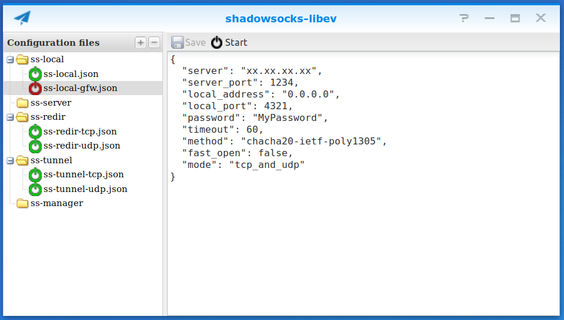

# shadowsocks-libev-dsm
 Synology DSM packages for Shadowsocks-libev, with v2ray plugin.
 Graphical interface to set-up the configuration files and start/stop the service(s) (experimental).
 


# Installation
Download the spk for your architecture from the [Release](https://github.com/davidcava/shadowsocks-libev-dsm/releases) section, then install using Synology Package Center button _Manual Install_. See  architectures on [Synology knowledge base](https://www.synology.com/en-us/knowledgebase/DSM/tutorial/General/What_kind_of_CPU_does_my_NAS_have).

# Usage
After installing the package, create configuration files and start the service(s). Services will restart automatically in case of reboot or restart from the Package Center.

Note: configuration file(s) are stored into `/var/packages/shadowsocks-libev/etc`.
Names must be: `ss-local.json` `ss-tunnel.json` `ss-redir.json` `ss-server.json` `ss-manager.json`
Additional instances can be created with names: `ss-local-xxx.json` `ss-tunnel-xxx.json` etc.
When removing the package, the config files are kept and reused if the package is reinstalled.

If ss-redir is used, then routing will be activated. The incoming non-local traffic will be routed to ss-redir through iptables. udp will/might not work (see limitation below).

In DSM7, the services use Systemd. You can check / control them in the SSH shell (as root) with commands such as:
```sh
systemctl list-units -a | grep pkg-ss-
synosystemctl start pkg-ss-local@ss-local
systemctl stop --type=service 'pkg-ss-*'
systemctl status pkg-ss-local@ss-local
```

# Limitation
- The user installing the package must have admin rights. Since 3.3.5, being the default admin user is not needed anymore.
- Since DSM7, after installing the package, it is needed to manually ssh into the Synology and run: sudo /var/packages/shadowsocks-libev/scripts/addprivileges.
- Service is considered "started" in DSM even though no shadowsocks service could be started. This is needed for DSM to show the shadowsocks config app in the app list.
- Branch dsm6 works on DSM 6.1 and 6.2 (not maintained anymore). Branch master works on DSM 7.
- I don't know how to compile v2ray-plugin using Synology's dev environment so I just copy the binaries provided in the project. Not really sure which one goes into which architecture so probably not working for all. If not working, just drop the v2ray-plugin executable into /var/packages/shadowsocks-libev/target/bin (and tell me what works for you).
- Graphical interface works well on my model and seems to work on other models. If any issue, use SSH and edit json files manually.
- Graphical interface does not allow to view the logs.
- DSM does not include the needed kernel modules for TProxy (at least on my model), which prevents using ss-redir with udp. Workaround is possible by recompiling the missing modules and iptables.
- When ss-redir is used, only incoming traffic is redirected (chain PREROUTING). DSM traffic itself is not sent to ss-redir (chain OUTPUT).
- I am using ss-local, ss-tunnel and ss-redir on my DS214play (evansport architecture) under DSM 7, anything else is not tested. Feedback welcome!

# Advanced
- It is possible to control which traffic goes to which ss-redir-xxx by putting iptables directives into files `ss-redir-xxx.ipt-rules-exclude` and/or `ss-redir-xxx.ipt-rules-include`. Packets matching the iptables rules within those files are excluded and/or included from being redirected. Those files cannot be created with the graphical interface.

Example: `/var/packages/shadowsocks-libev/etc/ss-redir-Korea.ipt-rules-exclude`
```sh
-m geoip --dst-cc EU,FR,LU,IT,PT,ES,DK,IE,GB,CH,SE,NL,AT,BE,DE
-m geoip --dst-cc AD,BG,CY,GI,GR,HU,IS,PL,FI,MT,NO,MC,RS,IM,CZ
```
# Build from source
- Setup the DSM toolkit for your model according to the official Synology [Developer's guide](https://originhelp.synology.com/developer-guide/)
- Download shadowsocks-libev source code into the toolkit
  ```sh
  cd /toolkit/source
  git clone https://github.com/shadowsocks/shadowsocks-libev.git
  cd shadowsocks-libev
  git submodule update --init --recursive
  ```
- Add or link the 2 subfolders `synology` and `SynoBuildConf` from `shadowsocks-libev-dsm` into the shadowsocks-libev source folder
  ```sh
  git clone https://github.com/davidcava/shadowsocks-libev-dsm.git
  ln -s ./shadowsocks-libev-dsm/SynoBuildConf ./shadowsocks-libev-dsm/synology .
  ```
- Download libev source into the toolkit and add the DSM build script
  ```sh
  cd /toolkit/source
  cvs -z3 -d :pserver:anonymous@cvs.schmorp.de/schmorpforge co -r rel-4_25 libev
  cd libev
  ln -s ../shadowsocks-libev/shadowsocks-libev-dsm/libev/SynoBuildConf .
  ```
- Download mbedtls source into the toolkit and add the DSM build script
  (cannot use Synology provided mbedtls library because it misses MBEDTLS_CIPHER_MODE_CFB)
  ```sh
  cd /toolkit/source
  git clone https://github.com/ARMmbed/mbedtls
  cd mbedtls
  ln -s ../shadowsocks-libev/shadowsocks-libev-dsm/mbedtls/SynoBuildConf .
  ```
- Download simple-obfs source into the toolkit and add the DSM build script
  ```sh
  cd /toolkit/source
  git clone https://github.com/shadowsocks/simple-obfs.git
  cd simple-obfs
  git submodule update --init --recursive
  ln -s ../shadowsocks-libev/shadowsocks-libev-dsm/simple-obfs/SynoBuildConf .
  ```
- Build for your architecture, example
  ```sh
  /toolkit/pkgscripts-ng/PkgCreate.py -p evansport -x0 -c shadowsocks-libev
  ```
- If everything went fine, package is now in `/toolkit/result_spk`

# Licence
    Copyright (c) 2018 2019 David Cavallini

    shadowsocks-libev-dsm is free software: you can redistribute it and/or modify
    it under the terms of the GNU General Public License as published by
    the Free Software Foundation, either version 3 of the License, or
    (at your option) any later version.
    
    shadowsocks-libev-dsm is distributed in the hope that it will be useful,
    but WITHOUT ANY WARRANTY; without even the implied warranty of
    MERCHANTABILITY or FITNESS FOR A PARTICULAR PURPOSE.  See the
    GNU General Public License for more details.

    You should have received a copy of the GNU General Public License
    along with shadowsocks-libev-dsm.  If not, see <http://www.gnu.org/licenses/>.
